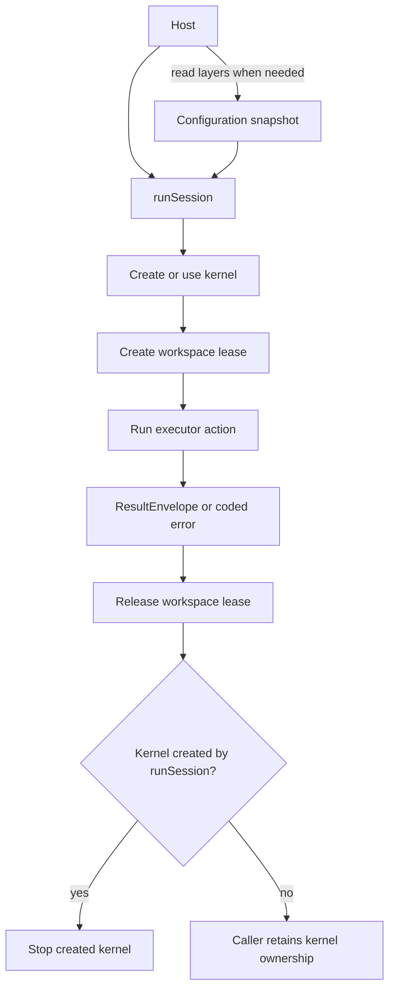
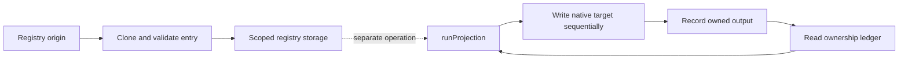

# Architecture

brambo is an SDK-first microkernel. It keeps stable composition rules in small packages and leaves vendor behavior at typed seams.

**On this page:** [Dependency graph](#the-downward-graph) · [Runtime lifecycle](#runtime-composition) · [Registry projection](#registry-ingestion-and-projection) · [Stable boundaries](#stable-boundaries)

## The downward graph

```text
contracts
  ↓
registry → projection → environment
  ↓           ↓
lock        kernel
               ↓
workspace / memory / adapter-cli
               ↓
             session
               ↓
              cli
```

The graph is a dependency rule, not just a diagram: packages may depend only on packages below them in the declared topology. `@brambodev/kernel` has zero runtime dependencies and never imports `@brambodev/contracts` at runtime.

## Runtime composition

A host normally enters through `@brambodev/session`:

1. `readExecutorConfigLayers` reads configuration layers.
2. `createSessionKernel` mounts the selected executor and workspace plugins.
3. `runSession` creates a workspace lease and registers the executor run as a kernel action.
4. The adapter returns a `ResultEnvelope`; the session releases the lease and stops a kernel it created.

A caller-supplied kernel remains caller-owned and is not stopped by `runSession`.

The lifecycle below separates configuration loading from execution. `runSession` cleans up the lease and any kernel it created; a kernel supplied by the host remains the host's responsibility.



## Registry ingestion and projection

Ingestion and projection are explicit operations. An origin's entry is cloned and validated before scoped storage; a later projection reads registry entries and the ownership ledger, writes native configuration sequentially, then records what it wrote. Ingestion alone does not run projection.



The ledger is the ownership record used for later drift inspection and safe reversal; it is not a trigger or a copy of the vendor configuration.

## Stable boundaries

| Boundary | Responsibility |
| --- | --- |
| Registry | Canonical, scoped skills and tools. |
| Projection | Native executor vocabulary and locations, plus ownership for reversal. |
| Kernel | Plugin validation, configuration, services, actions, records, and lifecycle. |
| Session | Composition of executor, workspace, policy, logging, and lifecycle. |
| Contracts | Public port types, schemas, coded errors, and behavioral suites. |

Adapters and providers are replaceable because the kernel consumes their contracts rather than vendor internals. A port author can install `@brambodev/contracts` alone and run the published clause suites.

## Boundaries that are intentionally honest

- A `MethodPlugin` is not a sandbox.
- `ToolProvider` discovers tools; `ToolExecutor` executes explicit invocations through a caller-owned sandbox session.
- Current CLI adapters run ordinary child processes. Workspace-relative behavior is measured per executor; OS isolation is not claimed by the adapter package.
- Unavailable information is represented as typed absence, not as a fabricated zero or a bare `null`.

## Where to start

Use `@brambodev/session` for an SDK host, `@brambodev/cli` only for the team's argv/JSON/exit-code binding, and `@brambodev/contracts` when authoring a third-party port.
