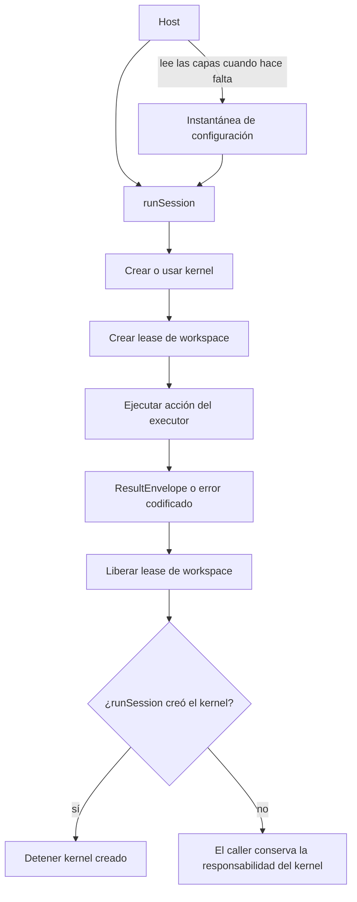

# Arquitectura

brambo es un microkernel orientado al SDK. Mantiene las reglas estables de composición en paquetes pequeños y deja el comportamiento específico del vendor en seams tipados.

**En esta página:** [Grafo de dependencias](#el-grafo-descendente) · [Ciclo de vida en runtime](#composición-en-runtime) · [Proyección del registry](#ingesta-del-registry-y-proyección) · [Límites estables](#límites-estables)

## El grafo descendente

```text
contracts
  ↓
registry → projection → environment
  ↓           ↓
lock        kernel
               ↓
workspace / memory / adapter-cli
               ↓
             session
               ↓
              cli
```

El grafo es una regla de dependencias, no solo un diagrama: los paquetes solo pueden depender de paquetes inferiores en la topología declarada. `@brambodev/kernel` no tiene dependencias de runtime y nunca importa `@brambodev/contracts` en runtime.

## Composición en runtime

Un host normalmente entra por `@brambodev/session`:

1. `readExecutorConfigLayers` lee las capas de configuración.
2. `createSessionKernel` monta los plugins de executor y workspace seleccionados.
3. `runSession` crea un lease de workspace y registra la ejecución del executor como una acción del kernel.
4. El adapter devuelve un `ResultEnvelope`; session libera el lease y detiene el kernel que creó.

Un kernel entregado por el host sigue bajo su responsabilidad y `runSession` no lo detiene.

El ciclo de vida separa la carga de configuración de la ejecución. `runSession` libera el lease y cualquier kernel que haya creado; un kernel provisto por el host sigue bajo responsabilidad del host.



## Ingesta del registry y proyección

La ingesta y la proyección son operaciones explícitas. La entrada de un origen se clona y valida antes de guardarse con scope; una proyección posterior lee las entradas del registry y el ledger de ownership, escribe la configuración nativa de forma secuencial y luego registra lo que escribió. La ingesta por sí sola no inicia una proyección.

```mermaid
flowchart LR
  accTitle: Ingesta del registry y proyección
  accDescr: Un origen del registry aporta una entrada clonada y validada al almacenamiento con scope. Una operación de proyección separada lee esa entrada y el ledger de ownership, escribe un destino nativo y registra el resultado propio en el ledger.
  Origin[Origen del registry] --> Validate[Clonar y validar entrada]
  Validate --> Scope[Almacenamiento del registry con scope]
  Scope -. operación separada .-> Project[runProjection]
  Ledger[Leer ledger de ownership] --> Project
  Project --> Target[Escribir destino nativo secuencialmente]
  Target --> Update[Registrar salida propia]
  Update --> Ledger
```



El ledger es el registro de ownership para inspeccionar drift y revertir de forma segura; no es un disparador ni una copia de la configuración del vendor.

## Límites estables

| Límite | Responsabilidad |
| --- | --- |
| Registry | Skills y tools canónicos y con scope. |
| Projection | Vocabulario y ubicaciones nativas del executor, más ownership para revertir. |
| Kernel | Validación de plugins, configuración, servicios, acciones, registros y ciclo de vida. |
| Session | Composición de executor, workspace, policy, logging y ciclo de vida. |
| Contracts | Tipos públicos de ports, schemas, errores con código y suites de comportamiento. |

Adapters y providers son reemplazables porque el kernel consume sus contratos, no los internals del vendor. Un autor de ports puede instalar solo `@brambodev/contracts` y ejecutar las suites de clauses publicadas.

## Límites deliberadamente honestos

- Un `MethodPlugin` no es un sandbox.
- `ToolProvider` descubre tools; `ToolExecutor` ejecuta invocaciones explícitas mediante una sesión de sandbox propiedad del caller.
- Los adapters CLI actuales ejecutan procesos hijos ordinarios. El comportamiento relativo al workspace se mide por executor; el paquete de adapters no afirma aislamiento del sistema operativo.
- La información no disponible se representa como ausencia tipada, no como cero inventado ni como `null` sin contexto.

## Por dónde empezar

Usa `@brambodev/session` para un host SDK, `@brambodev/cli` solo para el binding de argv/JSON/códigos de salida del equipo, y `@brambodev/contracts` al crear un port de terceros.
